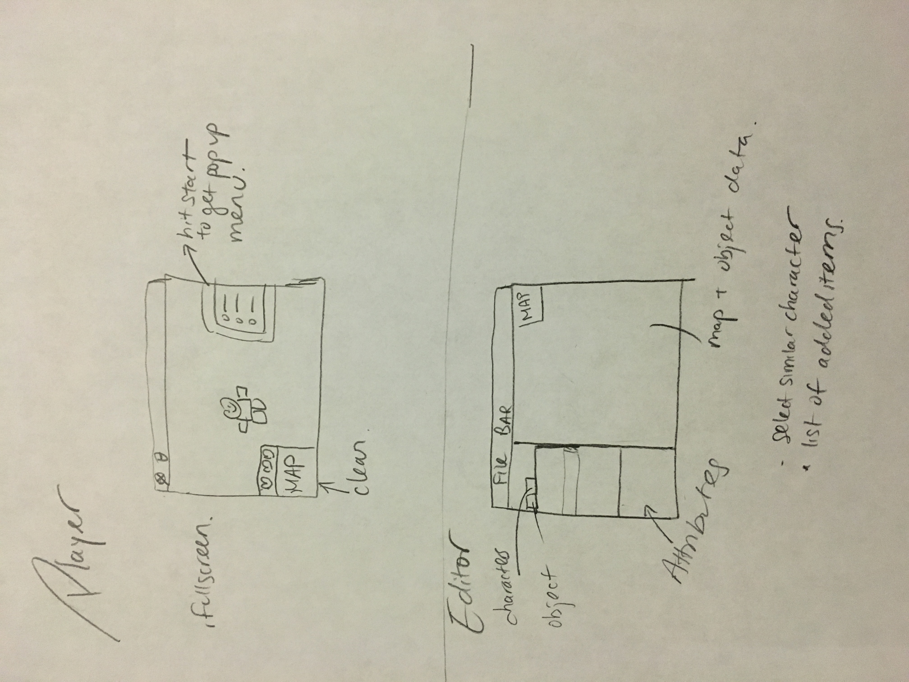

## Team Members
Salo Abraham
Alex Boss
Nathaniel Brooke
Gordon Huynh
Andres Lebbos
Harry Liu
Dhruv Patel
Adavit Reddy
Ashka Stephen
Justin Wang

### Introduction
Our team will be designing a program to create and play Role-Playing Games (RPGs). Basic components of our game include those outlined in the basic definition of a game, such as a player, a goal, a set of rules/restrictions, and decision points (or interactivity). Specific characteristics of RPGs include a character controlled by the user which embarks on a “quest” to accomplish one overarching goal. We are specifically implementing the strategy RPG since a central “quest” takes place on a map which the character traverses against opponents attempting to accomplish a specific goal. This is a strategy-based game typically not multiplayer, and examples include Stella Deus, Shining Force, Vandal Hearts and Fire Emblem. 

### Overview
The overall structure of the game includes a two-fold Model View Controller Design pattern (a diagram of which is attached below). The structure is broken down into two perspectives: editing and playing games. We will follow a MVC structure with the game state serving as the connecting point (which the XML and game-progress storage is based off of). The two MVCs (from the editor side and game-play side) will be connected through the game state (which will be connected to the file saving system and XML).

### User Interface

There are two main components to the User Interface. The player and the editor. For the player, a load menu will be displayed that contains a button that the user will use to upload a saved file. By uploading the file, the user will automatically trigger play. When the game starts, the user will already have access to default controls. However, the user may decide to change the controls by activating the pop-up menu (through a keyboard button press). The pop-up menu will have four different options. They are: items, goals, controls, and progress (save/exit). By selecting a menu option such as controls, you will be able to change your game experience. While the user is playing, he or she will always see the heads up display that contains information about your health and a snippet of the map. The player will be able to move around (forward, backwards, etc). The map will move around and you will be able to explore and complete your goals. There is a main goal and smaller goals (sub-quests) which may change. These can be seen in the goals section of the pop-up menu.

The second component of the UI is the editor which is made up of a menu bar which has options such a file. File will allow you to switch between scenes. One scene is used to edit the map and the game objects. In this scene, you will interact through the left side-bar. The side bar will consist of tabs and accordions. For instance, the tabs can be used to cycle through characters, enemies, items, and obstacles. You would drag and drop to the map on the right and by clicking on the object, you will be able to edit its attributes. This happens in a pane on the left side-bar below the accordions. The map on the right side is scrollable. You will be able to delete an object by dragging it to the trash. The second scene has a large tree-map which you can use to edit the goals and all the subgoals. Erroneous situations are brought to the user's attention through alerts. One possible error is if the user uploads an incorrect file.

* GameState: The GameState is the core class in the backend that contains the specific details for a particular game. This class has the functionality of not only storing all the GameObjects and GameConcepts needed for the particular game to run, but also of handling the interactions between GameObjects whenever needed or the interaction between GameConcepts and the main screen. For example, when a player walks to close to a collectable the player must be able to pick the item up and add it to its inventory. Additionally, when all the goals of the game are satisfied, the user must be notified that he has finished all the goals. This class benefits the overall design of the project because it contains a double job of storing and handling objects and their interactions. It doesn’t limit the extensibility of the engine because the class doesn’t care what to objects are interacting because it only notifies the objects for them to interact with each other. So, whenever an object or concept is added to the structure, the design of this class shouldn’t be modified.

* Entity: The Entity (all objects in the game) has an abstract “tree-form” hierarchy that allows it to represent all the concrete objects that a game might have. Each of these objects will contain a collection of Attributes which is a subclass of the GameConcept. Additionally, each game object has the functionality of allowing all the attributes to interact within each other. For example, whenever the health reaches zero in an enemy the Death Action should be activated and the object should die and do the final changes on the game before disappearing from the visual screen. Finally, each two objects from different classes are distinguished mainly by the attributes they contain or the way they use them. For example, each object in the game might contain different attributes. While the enemy has health and damage and when clicked on it will be attacked, the collectable doesn’t have a health or damage and when clicked it will be added to the player’s inventory. Additionally, the Death Action representing both of them is different, because when the enemy is killed some collectable might appear on the spot of the enemy, while when a collectable is dead, or better said, used it will change the state of the player. It is the job of each of the subclasses of the GameObject hierarchy to manage the interactions inside each of the objects’ attributes while at the same time allowing the game state to make two objects interact whenever necessary. Finally, in terms of design this abstract hierarchy is extensible for implementation because it is not limiting to the GameState meaning that you can have any combination of objects containing no limitation in their interactions that we call Actions. 

* GameConcept:The GameConcept represent those classes that cannot be visually seen on the board. It can viewed as those abstract concepts needed for the game. For example, the goals and attributes that the game contains. The game concept class needs access to the GameState in order to have access to both the GameObjects and the GameConcepts. It needs access to the first in order to know when a goal is completed. For example, in order to know that the goal of having all the enemies killed was achieved it must know that there are no enemies and therefore all the GameObjects are not an instance of the class Enemy. Additionally, access to the latter is also needed to advanced in the classical definition of role-playing. RPG games are characterized by always having something knew to do. This means that whenever a goal is achieved, another goal(s) appear for the user to continue playing in this role-playing theme. For example, when you kill all the guards, you may know enter the castle to kill the king. This might be thought of as a quest, but it is not linear because you shouldn’t be stuck at one goal and have nothing else or the same definition of RPG is lost. In conclusion, in order to modify the list of goals by completing other goals, a goal needs access to all the goals. 

* Goal: A goal is a class representing a state of the game that the player must achieve. The goal must view the entire state of the game in order to know if it achieved or not, and once it is it has the capability of adding new goals. This gives the capability to the goals to have the possibility of creating more goals in order to achieve a structure of role-playing by changing the goal and creating new ones while the game advances. The design for this class is not limiting because it is not dependant to what objects the game has, but relevant to the state as a whole.
	To go more into the specifics of design detail, we decided to implement Goals separate from the GameEntities themselves. Our structure now consists of GoalNodes (what the game creator will set) which contain Conditions which are implemented with the use of Sub-conditions.
	We considered implementing the goals and the goal tree with the use of enumerations We decided against this because of the inherent loss of flexibility that comes with enums. The benefit was simply the ease and simplicity of implementing this structure. Because we wanted to make goals as flexible of a component as possible (as they are essential components of any game since a game can’t function without a goal of some kind), we decided to implement this using interfaces. 
	A GoalNode is satisfied once all of its primary conditions (or those that definitely need to be implemented) are complete. The secondary conditions don’t necessarily need to be completed since the definition of a secondary condition is one that is optional. Each condition contained creates the necessary number of sub conditions needed. In the case of attribute-centered goals, subconditions will then 1. create the attribute that is the “goal” (which will be used to compare the current attribute to), 2. select a Condition Checker (which implements a comparison operator, such as less than and greater than, to compare the attribute values, and 3. takes in the current Game Entity, from which the current attribute will be extracted. 
		Together, all of this allow for a more extendable structure since the goals will be very flexible. For example, in the proposed structure, goals can address attributes and actions as well.

* Attributes: An Attribute is a class that has the functionality of storing one instance of a class that contains information or behaviour patterns of a specific object. These attributes can store anything from integers to define the health of an object to Actions which is an interface that defines the behaviour of an object. This attributes also have the capability of being changed whenever the object interacts with other objects. For example, when a player attacks an enemy the health of the enemy is lowered. Additionally, some attributes, specifically the ones that are actions, have the capability of changing the states of other attributes inside the same object. For example, if an enemy has the MovementAction of walking in circles, this action should be able to modify the location of the object with every step. This is open for extension because there is no limit on what an attribute can do or specify other than changing the attributes from other objects that are defined through the editor of the game.

* Action: The Actions are represented through a hierarchy. Whenever an attribute is declared to contain an Action it must have the possible actions it might contain under the hierarchy of the Action class. The Action’s job is define a pattern that changes the attributes of an object, or in very specific cases, adding information to the GameState. For example, a MovementAction will define how the object moves towards the player to attack him or back and forth guarding the entrance to something. Another example is the DeathAction that specifies what happens to the object when dead or used. This works both ways because if the object is a character that dies, it might leave an object on the floor, but if it is an item called health potion once used or dead it heals the player. Following on these examples some Actions might be designed to be limiting while others are not. For example, the DeathAction will add objects to the GameState while the MovementAction would only change the attributes inside an object. Additionally, the DeathAction might be limited by the possibilities it has: leaving a collectable on the spot it died or exploding and dealing damage and poison to enemies around it or a limited list of actions. On the other hand, actions like the MovementAction will not be limited because it will have velocities and acceleration that would define any pattern or graph the object would move through and therefore it won’t be under a limited list, but a more general one.

### Example Games
* The Zombie Apocalypse (survive): A game world is designed to generate zombies with time. So, the Game has an object (or several) that internally keep dying and as a DeathAction they create more enemies. These objects could be identified as Spanners (and could be added on because the game is open for extension). Additionally, there is a player in this world with only a sword and his only objective is to survive as long as possible in a magical house filled with portals that lead to new rooms with a random amount of spanners. The Goal of the game is survivability and the more time the player lives, the more the game moves towards achieving the goal (which is actually unachievable because it is endless). Will you survive long enough to save them all?
* The Silent Killer (kill them all): The player is in a small house (Note that this house has a few rooms just like in The Zombie Apocalypse with several portals!) with ten other friend characters that won’t attack him, unless ten minutes pass and they figure out that the player killed one of their friends. All players have the same statistics and they are trapped inside. The goal of the game is to kill all the players, but be aware, the players want to survive. If the player is seen by one of the friend characters in a room attacking another character, the friend characters will turn into enemies. In the background what the program will do is have one DeathAction that will consist of killing the friend and adding a new object with the exact same stats to the GameState. The only difference is that this enemy object will have a DeathAction that would actually die and will happen when the health reaches zero. Finally the player only has ten minutes to achieve his goal! This is simply having a subclass of the goal class that handles time and adding it to the GameState. Be the perfect assassin! Can you kill them before they know that you are the 
killer?
* The Pokemon Copy (collect them all):The player is found in a earth-like world filled with friendly creatures as states of Friend from the GameState hierarchy and his goal is to have them all! All creatures come with a percentage as an Attribute that defines the option of creating an enemy instead of achieving partially a goal. If the player succeeds trying to get a friendly creature to join him and help him in this world, nothing bad happens, but is the creature goes rogue it will attack him by turning itself into an Enemy in the exact same way as The Silent Killer game specified above worked. If the creature attacks the player, the player has the opportunity to invoke those characters he already tamed to attack the creature back, but be aware that any character that dies in battle is gone forever! NOTE: This game is a copy of Pokemon! Can you be the perfect explorer and catch all the Pokemons?

### Design Considerations
Some design considerations that we discussed to great length are included below:
1. Grid vs. Cartesian Plane Movement: The first is the idea of having all games be grid based where all objects are placed in a spot on the grid, and characters move between spots of the grid, while the second is the idea of having a map or a room and the characters move freely around the place while the other objects can be placed at any place. The latter would include diagonal movements which would not be as simple to implement in a grid based system . For example we needed some sort of determined movement for every character that was not a player. This meant that if a guard was going to move back and forth inside a fort, it needed to have that capability and the options were allowing the guard to move between any two determined locations through cartesian information or to move between spots on a grid. The reason why The Grid Movement option came up was because the implementation of the engine was getting so complicated that it got to the point where we seriously took this option to reduce the complication. This would have taken most of the job out of the MovementActions and the effect that told an enemy whenever a player was close enough to attack it. The Grid Movement would delete all these complications and reduce them to integers while at the same time it would simplify the entire game. However, we chose (through a vote) to move all objects on a cartesian plane (free movement) because it didn’t limit our program like The Grid Movement did. The movement we did not choose turned every single game our engine was allowed to do into a grid, while The Free Movement turned it into any two-dimensional game which is more open for extension. Additionally, if we had the cartesian plane movement coded, limiting player movement to a grid would be a relatively simple feature to add (while on the other hand, turning a Grid into any free map is more complicated).
2. The Iterator Method vs. The Bin Method: The first was about creating our own iterator over the structure of the game objects because it is saved as a Collection of Collections, while the last was doing the two lines to iterate over each collection separately. The iterator method loses the capability of looping over only one of the Collections inside the big Collection, while it solves the problem of forcing every person of writing a double-linked for loop. This issue was somewhat resolved, but it is not big in terms of the design because it easily changeable so we haven’t taken a final decision on it now, but we plan to do so before starting to code the back end because it doesn’t affect the way the front end works.
3. The Goal as a Goal vs. The Goal as an Attribute: Yet another implementation design that came into consideration was making the goal an attribute inside an object or a class with subclasses. The Goal as an attribute allowed every object to have a goal and therefore be part of the goal or not. For example, if the enemy had a goal, it would be false and would only turn true when the enemy got killed, but not all enemies had to be part of the goal. This implementation had the big advantage of not forcing the extendibility of the goal feature to “kill all” or “kill none”, but only “kill some”. While, at the same time, it had the disadvantage of only having one goal: kill these or collect these items (if an item was part of a goal). So, this feature came with a big advantage, and, at the same time, with a big disadvantage. We ended up choosing to make the goal a separate object from the entity (or the normal game object). Although goals have attributes, just like a Entity object, our primary intent was to make the game such that each game will always have a goal. Additionally, the attributes that a goal has are different from the attributes than a regular Entity object, such as an obstacle or an enemy. This is because goals have conditions to be met and a result due to that condition (such as passing to the next level, winning a prize, or simply traversing the goal tree such that additional goals are set). Thus not only does this fix the problem, but it also allows for extension.. This feature allowed extension in the sense that it didn’t tie the goal to Entity only, but to anything at all: survive ten minutes, kill enemies, or collect objects. And any other goals that we will add when we extend the engine. 
4. How Much Power Should the User Have? Another aspect of design and functionality the group discussed at length was where to draw the line between what the program cannot accomplish and what all the user can change and do in the game. An example of this would be the creation and editing of attributes. We decided to give the user the ability to edit attributes of specific entities while the game is in play, however not in real-time (meaning the user must pause before resuming). Another way we gave the user power  was by allowing the goal tree to be customizable. Each goal can have goals that stem off it such that once a goal is completed additional goals may be added. The user can specify which sequence of goals they’d like to accomplish in what order.

