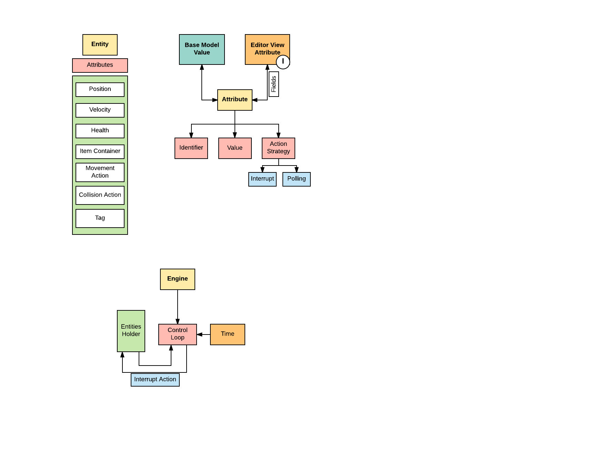
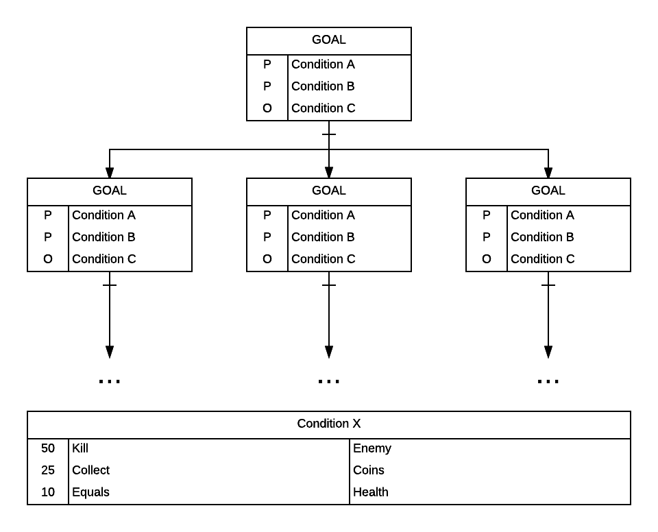

ePrintStackTrace
================
> Backend Design and Implementation

# Overall Design

# Attributes
 * Entities are made up entirely of attributes
    - Attributes link to model-specific values/strategies
    - Attributes define `Fields` to link model values to an Editable Interface
    - An Action (any game functionality) is a type of Attribute

# Actions
 * Actions are what define the main behavior of game entities. 
    - Customized / Variety
    - Predefined 
    - Extendible
    - Motion / Collision (on contact and on vicinity) / Other
 * Structure
    - Hierarchy
       1. Interrupt 
           * Collisions
       2. Polling
           * Movement
           * Spanner
           * Tower
    - Java functions

# Collisions
* Each GameEntity has an implicit "collision zone"
 - Prevent passing through objects
 - This is how level boundaries are set (think forest in Pokemon)
* Each GameEntity has a user-defined "effect zone"
 - Attach a behavior to the zone
 - Set properties of the zone (Radius, Enter/Exit/Stay)
 - Design tradeoff: how to handle multiple-frame collisions?

* Collision Checker
 - Parses all GameEntities to produce EntityPairs
 - Checks for collisions and forwards colliding Pairs to the Handler
* Collision Handler
 - Two colliding objects prescribe actions for each other
 - If A and B collide, A tells B what to do, and B tells A what to do
 - Ex: Enemy and Player collide, Enemy tells Player to slow itself, Player tells Enemy to hurt itself

# Goals

* Goal Attribute vs. Goal Object
 - Goal is necessary for Game State
 - No need to limit functionality of a goal
 - Allow for the condition and sub condition structure
 - Goal can be tied to anything (not just an entity)
* Enumerations
 - Allow for common preset goals, but not extensible
* Interface
 - Never need to add code
 - Implement Goals -> Condition -> Subcondition structure

 
### Example Subconditions
* If `<Test Attribute>` is `<Condition>` to/than `<Target Attribute>`
 - EX: If `HEALTH` is `GREATER` than `50HP`
* If `<Action>` has occurred (on `<Target Object>`)
 - EX: If `MOVE FORWARD` has occurred

### States
* Passed/Completed
* Failed
* In Progress

### Goal Types for Conditions
* Primary (required for completion of condition)
* Secondary (optional)

### Tags
* Tag by unique ID number
 - UI will allow users to select by entity type 

### Extensions
* Implement Actions Message Board

# Resource Engine

* FileExtenson to encapsulate file types
* Cache files based on FileExtension and directory
* Can search through child directories